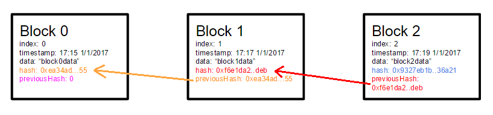

# DONE Introduction

## Definition of the problem

There are too many blockchain platform with different features implementing Smart Contracts and DApps. Which blockchain is the best for my DApp? cite:porru2017blockchain

## Main Goal

Compare Smart Contracts Platforms to be able to recomend the best according with the purpose of the application.

### specific goals

-   Analyze the requirements, design and impement for a loyalty program to have a point of comparison between different smart contracts platforms.
-   Identify the metrics used in decentralized applications to be compared, researching in the literature.
-   Extract the metrics of each loyalty program implementation to compare each smart contract platform running all the implementations.

## Scope and limitations

-   It will be implemented a loyalty program on Ethereum and Waves with interaccion with the user from sms
-   This work does not include a website or phone application
-   We wont lauch this to the market
-   It will be developed for just one developer, so it will be a bias

## Methodology

-   Implement a loyalty program in different blockchain platforms.
-   Extract quantitative and qualitative metrics.

## Contributions

-   A comparison between Ethereum, Waves and EOS Smart Contracts platforms
-   Implementation of a loyalty program on Ethereum and Waves
-   Benchmarking about features in each platform

## How this thesis organized

-   Background
-   Methodology
-   Experiment
-   Results
-   Discussion of the results
-   Conclusion and Lessons Learned
-   References

# DONE Background

## Loyalty programs

They are mechanisms to generate customer loyalty. Basically, businnes reward the customer loyalty by giving products or services

### History

-   Airlines' frequent fliers schemes 1981
-   Hotel's rewards
-   Banks
-   Grocery Stores

### Size of the industry

-   Membership has reached 1.3 billions (The COLLOQUY loyalty marketing census: sizing up the US loyalty marketing industry)
-   The average US household belongs to 12 loyalty programs (The COLLOQUY loyalty marketing census: sizing up the US loyalty marketing industry)
-   Only 4.7 yield active participation

## Blockchain

### Definition

It is a network of nodes conected each other via peer-to-peer, every node in the network has an exact copy of the blockchain.

### Definition

Blocks saves the transactions of the users, and blocks are linked each other through the hash of the last block

### The importance of blockchain industry

Blockchain allows to generate transaction of value between users, the value sent between users is called cryptocurrency. Has been seen that capitalization in blockchain could be powerful.

### History

-   Bitcoin (2008) (Bitcoin: A peer-to-peer electronic cash system)
-   Ethereum (2015)
-   Fork: Ethereum and Ethereum Clasic (2016)

### Bugs in history of smart contracts <a id="fnr.1" class="footref" href="#fn.1">1</a>

-   The DAO Attack ($60) cite:luu2016making
-   King of the Ether Throne <a id="fnr.2" class="footref" href="#fn.2">2</a>
-   Multi-player Games
-   Rubixi
-   GovernMental
-   Dynamic libraries

<a id="fnr.1.100" class="footref" href="#fn.1">1</a> (The goal question metric approach)

<a id="fnr.2.100" class="footref" href="#fn.2">2</a> (The second citation)

### Consensus Algorithms

When a blockchain needs to insert a new node into the blockchain should be a consensus, this means, all nodes agree that the new block is correct.

There are some algorithms to archive consensus:

-   POW (Proof of Work)

In a proof of work algorithm, the node that insert the new block in the blockchain is called "miner", the miner selection process is done solving puzzles, the first node in solve the puzzle will add the new block. Some of the blockchain platforms implementing proof of work algorithm are:

-   Bitcoin
-   Ethereum

-   POS (Proof of Stake)

In a Proof of Stake algorithm, participants have to stake some of cryptocurrency, the more cryptocurrency you stake the more probability of win you have

-   Others

There are others consensus algorithms, but they are algorithms based on Proof of Work and Proof of Stake

### Smart Contracts

Smart Contracts are programming script inside the blockchain, they are used to simulate real world contracts in a blockchain Smart Contracts can be Executed autamatically.

### Tokens

With Smart Contracts can be created new currencies called "tokens". Some blockchain platforms create tokens with standars (like ERC-20) to be compatible. You can use Wallets in which you can save tokens and cryptocurrencies. Also there are exchanges for tokens created by the blockchain users. (Waves)

### Decentralized applications

You also can build "Decentralized applications" through Smart contracts. Decentralized applications are applications running inside a blockchain.

## Blockchain Platforms

### Bitcoin

In 2008, Nakamoto presented Bitcoin as a peer-to-peer cash system, so, users can send payments directly each other, Bitcoin uses blockchain technology. As most of blockchain implementation, transactions in Bitcoin are validated by a consensus algorithm called Proof Of Work. Bitcoin is known as: cryptocurrency, system of transactions and blockchain Bitcoin as a currency can have a price, this price can

### Ethereum

Such as Bitcoin, Ethereum is an implementation of blockchain concepts, but, it implement Smart Contracts. Users in Ethereum can create and run Smart Contracts inside, they run in the Ethereum Virtual Machine (EVM). EVM could be compared with a backend of a Web application.

### Waves

Waves is a decentralized blockchain focusing on custom blockchain tokens operations (Waves white paper) Waves has a Decentralized Exchange (DEX) and a easy way to create tokens Leased Proof-of-Stake (LPoS) is a consensus algorithm used for Waves

### Cardano

Cardano is presented as the first blockchain implementing Proof-of-Stake consensus algorithm, this protocol is more efficient than Proof-of-Stake because it needs less computing power. Cardano uses two ways to create and run Smart Contracts and Descentralized Applications; Plutus (a functional programming language based on haskell), and Marlowe (an intuitive platform for developing Smart contracts)

### Cardano

General and small modules (among others) are Benefits of Plutus (a functional programming language) (Cite Why functional programming matters)

### EOS

EOS is a blockchain platform that can scale to millions of transactions per second, eliminates user fees and allows for quick and easy deployment and maintenance of decentralized applications. Cite eos technical paper

## Metrics

Measurement is useful to answer some questions at the begining of a project. cite:caldiera1994goal

-   How much will the project cost?
-   What is the frequency of certain types of errors?
-   What is the impact of technology X on the productivity of the project?
-   Etc&#x2026;

### Quantitaive

-   Cost of transaction

Almost every blockchain platform collect a fee for making a transaction, it is called "Cost of transaction"

-   Speed

Since blockchain is a distributed system in which every node has a copy of the database (blockchain), transactions tends to be slow. So, speed of transactions is a metric to take in count for decentralized applications.

-   Halstead metrics

Due Decentralized applications are developed with smart contracts and smart contracts are programming scripts, we can use a static code metric, we decided to use the metric of complexity Halstead metric

### Qualititive

-   Configuration

Decentralized applications need configurations (e.g., run a node server)

-   Features

-   Consensus algorithm

We consider that consensus algorithm is a qualitative metric.

-   Authentication methods

In blockhain platforms there are different ways to autenticate.

# TODO Methodology

-   Identify valuable metrics in DApps
-   Analyze requirements and design a loyalty program
-   Implement a loyalty program
    -   Ethereum
    -   Waves
    -   EOS
-   Cuantify metrics of the implementations
-   Compare metrics
-   Discuss results

## Requirements Specification of a loyalty program.

-   Will design some User Stories
-   Answering What? Who? and Why?

## Design and implementation of a loyalty program in Ethereum

Will design with:

-   Context diagram
-   Sequence diagrams

## Design and implementation of a loyalty program in Waves

Will design with:

-   Context diagram
-   Sequence diagrams

## Selection and extraction of features

Will be compared

-   Cuantitative
    -   Cost of transactions
    -   Speed of transactions
    -   Halstead complexity
-   Cualitative
    -   Easy to develop
    -   Features
    -   Consensus algorithm
    -   Authentication methods

### Cost of transactions

This is a blockchain metric, because (almost) every blockchain platform charges a fee to the users for making transactions

### Speed of transactions

Another blockchain metric is the speed of transactions, this metrics is used because transactions in a blockchain are not immediat

### Halstead complexity

We choose this metric because Smart Contracts are prograaming scripts and they contain code. Halstead metrics are metrics for lines of code.

### Easy to develop

We refer to "easy to develop" to the things that we have to do to develop some system.

### Features

Features are the thing that we will develop. Some implementations will have more features than others.

### Consensus algorithm

Consensus algorithm is a very important cualitative metric in blockchain platforms, this says how nodes agree to the creation of new blocks

### Authentication methods

We will compare the ways that every blockchain platform authenticate the users.

## Comparison of the features

We are looking for the blockchain platform that:

-   Has the lowest transaction fee
-   Make transactions faster than others
-   Has the lowest halstead complexity
-   Is easy to develop
-   Has the best consensus algorithm
-   Has the best authentication methods

# Experiment

## Creation of a loyalty program in Ethereum

## Creation of a loyalty program in Waves

## Analysis of a loyalty program developed in EOS

## Extracting features

# Results

# Discussions of results

Only here it can have your personal opinions

# Conclusions and Lessons Learned

# References

bibliography:bibliography.bib

## Footnotes

<a id="fn.1" class="footnum" href="#fnr.1">1</a> 

<a id="fn.2" class="footnum" href="#fnr.2">2</a>